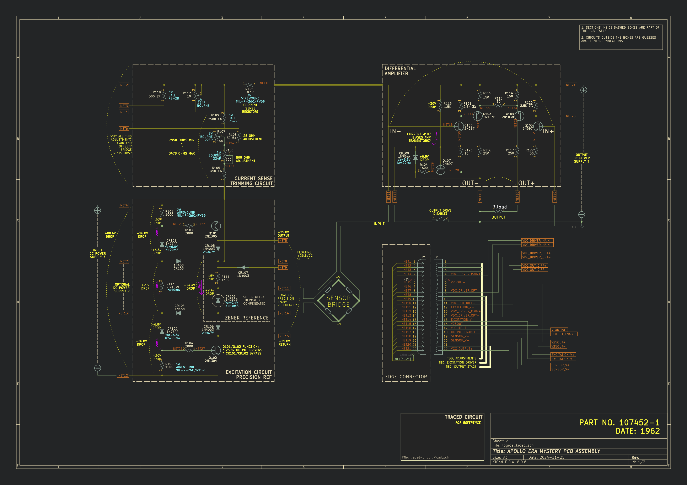

# Apollo-Era-Card-RevEng

This repo documents additional explorations into the reverse engineering
effort of an Apollo-era printed circuit board assemly that Skyhawkson
obtained earlier this year. See his project at the [original
repo](https://github.com/Skyhawkson/Apollo-Era-Card-RevEng/tree/main).

_work in progress, still documenting the process and observations
check again in a few days_

### Best Guess

This is an interface board for reading sensors such as strain gauges. 
It features a precision voltage source to excite the bridge. It also 
has a differential amplifier to scale up the sensor voltage and
proportionally drive an output load. The output stage has an enable pin,
suggesting that multiple card outputs may be multiplexed into one analog
to digital circuit card. That makes sense, since scanning through a
bunch of sensors over and over again makes sense in the context of
running through test sequences.

Maybe.

### Schematic

Schematic [(PDF)](eda-logical/logical-sch.pdf)

### Original Readme

Reverse Engineering an Apollo-Era Circuit Card

https://github.com/Skyhawkson/Apollo-Era-Card-RevEng/tree/main

[Writeup on hackaday.io](https://hackaday.io/project/194704-reverse-engineering-an-apollo-era-circuit-card)

